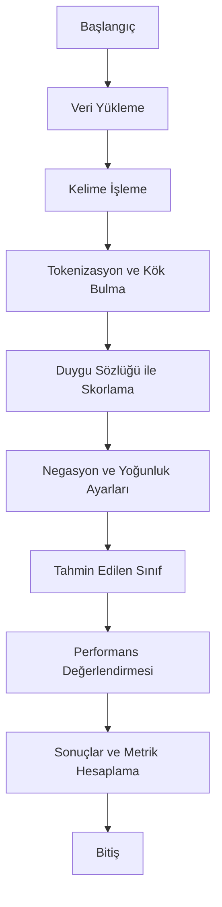

# Python ile Duygu Analizi Projesi 📊

## Giriş ve Genel Bakış 🌟
Bu proje, metin tabanlı veri kümleri üzerinde Türkçe duygu analizi gerçekleştirmek amacıyla geliştirilmiştir. Temel hedefler:

- **Cümlelerin Duygusal Durumunu Belirleme:** Kelimelerin pozitif, negatif veya nötr değerlerini analiz ederek cümlelerin genel duygu durumunu tespit etmek.
- **Performans Ölçümü:** Doğruluk, kesinlik, anma ve F1-skoru gibi metriklerle model performansını değerlendirme.

### Projenin Konusu ve Kullanım Alanları
Bu sistem, duygu sözlüğü, yoğunlaştırıcı ve zayıflatıcı kelimeler ile olumsuzlama ifadelerini temel alarak çalışmaktadır. Aşağıda sistemin öne çıkan özellikleri ve potansiyel kullanım alanları belirtilmiştir:

- **Müşteri Geri Bildirim Analizi:** Şirketler, bu sistemle müşteri geri bildirimlerini analiz ederek memnuniyet seviyelerini ölçebilir.
- **Sosyal Medya Takibi:** Sosyal medya paylaşımlarındaki genel duygu durumunu öğrenmek için kullanılabilir.
- **Akademik Araştırmalar:** Dil ve duygu analizi çalışmaları için bir temel oluşturabilir.

### Sistem Çalışma Mantığı: 
Bu proje, aşağıdaki örnek üzerinden daha iyi anlaşılabilir:

#### Giriş Metni:
- **Cümle:** `"Bugün hava çok güzeldi, çok mutluyum!"`
- **Kelime Ayrımı:** `['bugün', 'hava', 'çok', 'güzel', 'mutlu']`
- **Duygu Analizi Adımları:**
  1. Kelimeler duygu sözlüğüne göre değerlendirilir.
  2. "Çok" gibi yoğunlaştırıcı kelimeler etkileri artırır.
  3. Toplam duygu puanı hesaplanır: **1.8**
  4. Tahmini Duygu: **Pozitif**

### Örnek Sonuçlar:
| Cümle                                | Tahmin   | Gerçek   | Duygu Puanı |
|--------------------------------------|----------|----------|---------------|
| "Ben elma yemeyi seviyorum."        | Pozitif  | Pozitif  | 0.6           |
| "Bugün hava berbat."               | Negatif  | Negatif  | -1.2          |
| "Bu film ne iyi ne kötüydü."       | Nötr      | Nötr      | 0.0           |

---


---

## Model Yapısı ve Kod Modülleri 🧠

Bu proje, farklı işlevleri yerine getiren modüllere ayrılmıştır. Aşağıda her bir modülün detaylı işlevleri ve kullandığı teknikler açıklanmıştır:

---

### **1. Lexicon.py**

**Fonksiyonlar ve Amaçlar:**
- `load_lexicon_from_xml`: 
  - Kelime duygu skorlarını içeren bir XML dosyasını okur ve pozitif/negatif skorları birleştirerek her kelime için bir genel duygu skoru oluşturur.
- `load_modifiers`: 
  - Duygu yoğunluğunu artıran (örn. "çok") veya azaltan (örn. "biraz") kelimeleri bir metin dosyasından yükler.
- `load_negation_words`: 
  - Olumsuzlama kelimelerini bir liste olarak döndürür ve bu liste, metindeki kelimelerin duygu skorlarını ters çevirmek için kullanılır.

---

### **2. Preprocessing.py**

**Fonksiyonlar ve Amaçlar:**
- `tokenize_and_stem`: 
  - Metni kelimelere ayırar ve Türkçe stopwords listesini kullanarak gereksiz kelimeleri filtreler.
  - Zemberek kullanarak kelimelerin köklerini (örn. "gidiyorum" → "git") tespit eder.
- Alfanümarik olmayan karakterleri ve noktalama işaretlerini temizler.

**Görsel Destek:**
Bir cümledeki kelimelerin köklerine indirgenmesini şu şekilde görüntüleyebiliriz:

| **Orijinal Cümle**         | **Tokenlar**               | **Kökler**       |
|-----------------------------|---------------------------|------------------|
| "Bugün hava çok güzeldi." | ["bugün", "hava", "çok", "güzeldi"] | ["bugün", "hava", "çok", "güzel"] |

---

### **3. Sentiment_analysis.py**

**Fonksiyonlar ve Amaçlar:**
- `calculate_sentiment`: 
  - Metindeki her kelimenin duygu skorunu hesaplar ve toplam duygu puanını döndürür.
  - Yoğunlaştırıcı/zayıflatıcı kelimeler ile olumsuzlama kelimelerinin etkilerini dikkate alır.
- `analyze_sentiment`: 
  - Hesaplanan duygu puanına göre metni "Pozitif", "Negatif" veya "Nötr" olarak sınıflandırır.

---

### **4. Metrics.py**

**Fonksiyonlar ve Amaçlar:**
- `calculate_metrics`: 
  - Modelin performansını değerlendirmek için doğruluk, kesinlik, anma ve F1-skoru hesaplar.

---

### **5. Main.py**

Bu Python dosyası, projenin tüm bileşenlerini birleştirerek duygu analizi sürecini yönetir:

- **Veri Yükleme:** Kullanıcının analiz etmek istediği metin dosyasını okur.
- **Duygu Analizi:** Her bir cümle için duygu puanı ve sınıf tahmini yapar.
- **Sonuç Kaydetme:** Analiz sonuçlarını bir Excel dosyasına kaydeder.

**Fonksiyonlar ve Amaçlar:**
- `analyze_excel(input_file, output_file)`: Bu fonksiyon, bir Excel dosyasındaki cümleleri duygu analizi için işler ve sonuçları yeni bir Excel dosyasına kaydeder.

---

## Örnek Çalışma 📄

### Giriş Metni:
- **Cümle:** `"Ben elma yemeyi seviyorum."`
- **Kelime Ayrımı:** `['ben', 'elma', 'yemeyi', 'sev']`
- **Sonuç:**
  - Gerçek Sınıf: **Pozitif**
  - Tahmin: **Pozitif**
  - Duygu Puanı: **0.6**

---

## Performans Analizi 📈

### 📊 Metrikler

Projenin farklı aşamalarında duygu analizi için yapılan testlerin sonuçları aşağıda listelenmiştir. Doğruluk oranı, kesinlik, anma ve F1 skoru, iyileştirme adımları ve modelin gelişimi göz önünde bulundurularak analiz edilmiştir.

#### Test Sonuçları:

| **Test Aşaması**  | **Doğruluk (Accuracy)** | **Kesinlik (Precision)** | **Anma (Recall)** | **F1 Skoru (F1-Score)** |
|--------------------|-------------------------|--------------------------|-------------------|-------------------------|
| 🟢 İlk Test          | %50                    | %56                        | %62                | %60                    |
| 🟡 İkinci Test       | %56                    | %58                        | %66                 | %62                    |
|🟠 Üçüncü Test       | %64                    | %69                        | %75                 | %72                    |
|🔵 Dördüncü Test     | %68                    | %75                        | %81                 | %78                    |
|🔴 Beşinci (Son) Test| %77                    | %83                     | %89              | %86                    |

#### Gözlemler:

1. **İlk Test:** Temel modelleme ve basit sözlük tabanlı analiz kullanılarak elde edilen doğruluk oranı %50 idi.
2. **İkinci Test:** Kelime önişleme tekniklerinin eklenmesiyle doğruluk oranı %56 ya yükseldi. Bu aşamada stopword temizliği ve tokenizasyon kullanıldı.
3. **Üçüncü Test:** Zemberek entegrasyonu ile kök bulma işlemleri eklendi. Bu geliştirme, doğruluk oranını %64 e çıkardı.
4. **Dördüncü Test:** Olumsuzlama kelimelerinin ve yoğunlaştırıcı/zayıflatıcı ifadelerin etkileri modele dahil edildi. Bu aşamada doğruluk oranı %68 e ulaştı.
5. **Beşinci Test:** Hiperparametre optimizasyonu ve kapsamlı model iyileştirmeleri ile son test sonuçları elde edildi. Sonuç olarak doğruluk oranı %77, kesinlik %83, anma %89 ve F1 skoru %86 olarak kaydedildi.

#### Sonuç:

Test sonuçları, modelin gelişimini net bir şekilde göstermektedir. Her bir geliştirme adımı, doğruluk oranı, kesinlik, anma ve F1 skoru üzerinde belirgin bir iyileşme sağlamıştır. Bu sonuçlar, Türkçe metin tabanlı duygu analizi için uygulanan tekniklerin başarısını ortaya koymaktadır.

Gelecekte, daha geniş veri kümeleri ve ileri seviye modellerin kullanılması ile doğruluk oranının daha da artırılması hedeflenmektedir.

. 
. 
. 

---
#### 📜 Akış Diyagramı:

Aşağıdaki diyagram, duygu analizi sürecinin genel işleyişini göstermektedir:


---
#### Kullanılan Teknolojiler:

1. 🐍 **Python**: Projede Python, verilerin işlenmesi, metinlerin analiz edilmesi ve sonuçların hesaplanması için ana programlama dili olarak kullanılmaktadır.
2. 📊 **Pandas**: Excel dosyalarından veri okuma, veriyi düzenleme ve analiz sonuçlarını raporlama işlemlerinde kullanılmıştır.
3. 🛠️ **NLTK**: Metinleri kelimelere ayırmak (tokenization) ve Türkçe stopwords (anlamsız kelimeler) listesini almak için kullanılmıştır.
4. 🔤 **Zemberek**: Metinlerin dilbilgisel analizini yapmak, kelimelerin köklerine indirgenmesi (stemming) ve anlamlı kelimeleri ayıklamak için kullanılmıştır.
5. 🔗 **JPype**: Python ile Java tabanlı kütüphaneler arasında köprü kuran bir kütüphane olup Zemberek ile entegrasyon sağlamak için kullanılmıştır.
6. 🗂️ **XML ve ElementTree**: Lexicon (kelime listesi) dosyasını XML formatında okuyup işlemek için kullanılmıştır.: Lexicon (kelime listesi) dosyasını XML formatında okuyup işlemek için kullanılmıştır.
---

## Nasıl Çalıştırılır? 🚀

### Gereksinimler:
- Python 3.8+
- İlgili kütüphaneler:
  ```bash
  pip install pandas nltk zemberek jpype1
  ```

### Çalıştırma Adımları:
1. Depoyu klonlayın:
   ```bash
   git clone https://github.com/ncrim7/turkish-sentiment-analysis
   ```

2. Gerekli dosyaları indirin ve yerleştirin:
   - **Lexicon.xml**, **Boosters.txt**, **Diminishers.txt**, **Negation_words.txt**.

3. Ana dosyayı çalıştırın:
   ```bash
   python main.py
   ```

---

## Gelecek Çalışmalar 💡

1. **Derin Öğrenme Yöntemleri:** Daha yüksek doğruluk oranları için sinir ağları entegre edilebilir.
2. **Daha Geniş Veri Kümesi:** Daha fazla dil desteği ve genişletilmiş duygu sözlükleriyle çalışılabilir.
3. **Web Uygulaması:** Sistem, Flask veya FastAPI ile kullanıcı dostu bir arayüzde sunulabilir.

---

Bu projeyle ilgili sorularınız veya önerileriniz varsa lütfen benimle iletişime geçmekten çekinmeyin! 😊
---
➤ Açıklama Videosu : [`Sentiment Analysis`](https://youtu.be/Apg5fR_7C1A)
